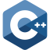

## 🙇 Information About Me 

Hey there, I'm **Neria Ben David** 👋  

👨‍🔬 Deeply passionate about **Mathematics**, **Coding**, and **Technology**.   
🎓 Third-year **BSc Computer Science** student at **[The Hebrew University of Jerusalem](https://en.huji.ac.il/)**.
##

## 💻 Personal Projects
-   [**Guardyush App**](https://github.com/neriabd/)  

## 📽️ University Projects  
-  🮠[**Nand2Tetris**](https://github.com/neriabd/Nand2Tetris)  
-  📷 [**Image Processing**](https://github.com/neriabd/ImageProcessing)  
-  🖥️ [**Operating Systems**](https://github.com/neriabd/OperatingSystems)  
-  ⏳ [**Workshop in C & C++**](https://github.com/neriabd/Workshop-C-CPP)  
-  🗣️ [**Natural Langugage Processing**](https://github.com/neriabd/Natural-Language-Processing)  
-  📊 [**Introduction To Machine Learning**](https://github.com/neriabd/IML.HUJI)  

## 👨‍💻 Programming Languages & Frameworks

<!-- ##  --> 
<!--  --> 
<!-- ) --> 
<!--  --> 
<!-- --> 
<!-- --> 
<!-- --> 
<!-- --> 
<!-- --> 
<!-- --> 

)

<!--
**neriabd/neriabd** is a ✨ _special_ ✨ repository because its `README.md` (this file) appears on your GitHub profile.

Here are some ideas to get you started:

- 🔭 I’m currently working on ...
- 🌱 I’m currently learning ...
- 👯 I’m looking to collaborate on ...
- 🤔 I’m looking for help with ...
- 💬 Ask me about ...
- 📫 How to reach me: ...
- 😄 Pronouns: ...
- ⚡ Fun fact: ...
-->
